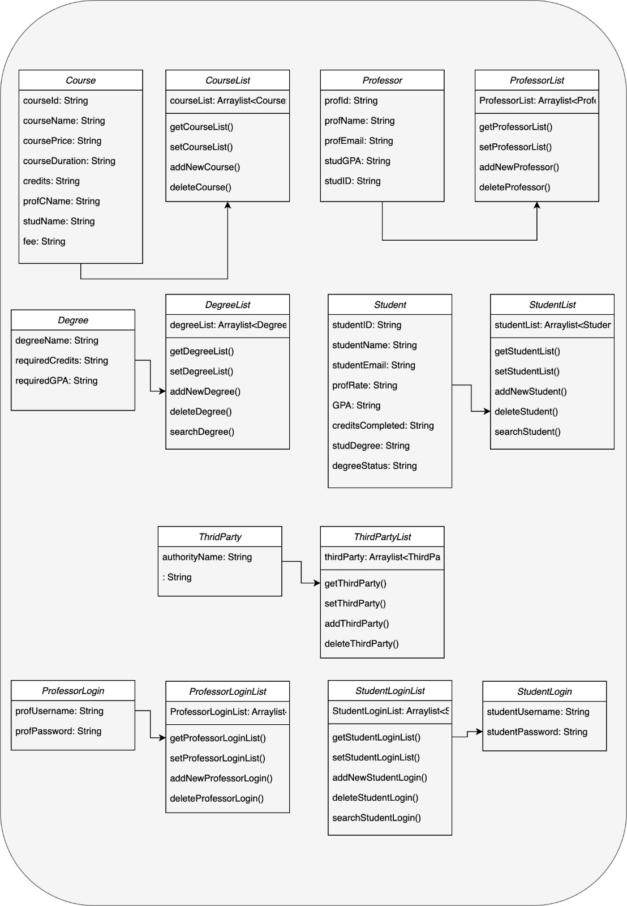

Flow of the application: 

1) Firstly, the admin logs in with admin credentials and can add, update and delete professors, students, courses and degrees Third party is offering.
2) Then Student logs in to see his details and the available courses. He/She can register from the available courses, can pay the fees, Request for a degree and can even provide the feedback of that professor.
3) Professor then logs in, to see the courses that he/she is teaching. They can even see the list of students enrolled under him. They can later on add, update or delete their own courses.
4)Professor when goes to the panel that has list of students under him, he can even grade them.
5)Then third party is used to accept or reject the students degree. When logged in, third Party can see the students requested for a Degree. They can approve or reject based on the GPA they secured in that course.
6)Lastly, Students whose degree is accepted can view their transcripts consisting of their ID, name, email, GPA, credits completed, Degree name and the courses they have taken.

So how is our code better than the university model?
Our model is automates various administrative processes like student course registration , paying fees to name a few which exponentially reduces paper work for the university. Making our model more efficient and user friendly. Our model allows users to navigate through panels quickly and without any hassle or confusion.

Most Importantly our state-of-the-art features are the feedback mechanism and a Third Party certification authority. Feedback option allows users to get to know their professors better. Faster Decision is made regarding the student degree with the help of Third Party certification authority.  

Class Diagram:

